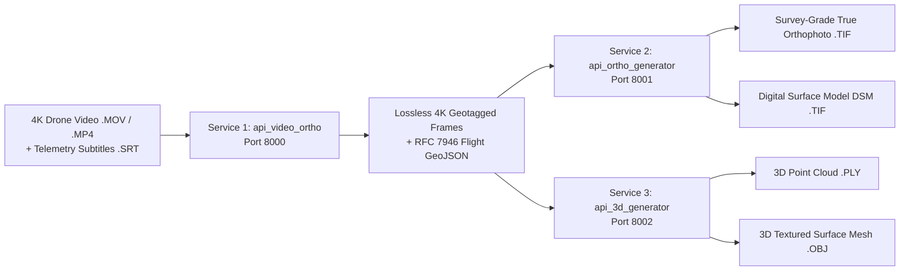

# 🛰️ Drone Photogrammetry & Orthophoto Suite

A modular, production-ready microservice architecture for aerial drone surveys: extracting high-resolution video frames with embedded EXIF GPS telemetry, generating survey-grade **2D True Orthophoto & DSM GeoTIFFs**, and reconstructing **3D Point Clouds (`.ply`) & Surface Meshes (`.obj`)**.

---

## 🏛️ Microservice Architecture



---

## 📦 Services Overview

| Microservice | Port | Primary Purpose | Tech Stack | Documentation |
|---|---|---|---|---|
| [`api_video_ortho`](./api_video_ortho) | `8000` | Extracts 4K frames, synchronizes SRT telemetry, injects EXIF WGS-84 GPS, generates GeoJSON flight tracks. | OpenCV, Piexif, Pillow, FastAPI | [README](./api_video_ortho/README.md) |
| [`api_ortho_generator`](./api_ortho_generator) | `8001` | High-accuracy photogrammetric 2D True Orthophoto and 3D DSM generation using PyCOLMAP SfM + GPS alignment. | PyCOLMAP, Rasterio, GDAL, SciPy, OpenCV | [README](./api_ortho_generator/README.md) |
| [`api_3d_generator`](./api_3d_generator) | `8002` | Dedicated 3D Structure from Motion (SfM), point cloud triangulation, and Poisson surface meshing. | PyCOLMAP, Open3D, PyTorch, FastAPI | [README](./api_3d_generator/README.md) |

---

## 🚀 Quickstart Guide

### Option 1: Run All Services via Docker Compose

```bash
docker-compose up --build -d
```
All 3 services will be running simultaneously:
- 🎥 **Video Extractor API**: [http://localhost:8000/docs](http://localhost:8000/docs)
- 🗺️ **2D Orthophoto API**: [http://localhost:8001/docs](http://localhost:8001/docs)
- 🗿 **3D Reconstruction API**: [http://localhost:8002/docs](http://localhost:8002/docs)

### Option 2: Run Individual Services Locally

#### 1. Start Video Frame Extraction API (Port 8000)
```bash
cd api_video_ortho
pip install -r requirements.txt
python run_server.py
```

#### 2. Start 2D Orthophoto API (Port 8001)
```bash
cd api_ortho_generator
pip install -r requirements.txt
python run_server.py
```

#### 3. Start 3D Reconstruction API (Port 8002)
```bash
cd api_3d_generator
pip install -r requirements.txt
python run_server.py
```

---

## 🔌 End-to-End Workflow Example

### Step 1: Extract 4K Frames & Inject EXIF GPS Telemetry
```bash
curl -X POST "http://localhost:8000/api/v1/jobs/extract-from-path?async_mode=false" \
  -H "Content-Type: application/json" \
  -d '{
    "video_path": "D:/ortho_generator/DJI_0527.MOV",
    "srt_path": "D:/ortho_generator/DJI_0527.SRT",
    "frame_interval_sec": 1.0,
    "quality": 100
  }'
```

### Step 2: Generate Survey-Grade 2D True Orthophoto & DSM
```bash
curl -X POST "http://localhost:8001/api/v1/ortho/generate-from-path?async_mode=false" \
  -H "Content-Type: application/json" \
  -d '{
    "frames_dir": "D:/ortho_generator/api_video_ortho/outputs/sample_run/frames",
    "engine": "accurate",
    "target_gsd_cm": 5.0,
    "generate_dsm": true,
    "blend_mode": "multiband"
  }'
```
* Download GeoTIFF: `GET http://localhost:8001/api/v1/ortho/jobs/{job_id}/geotiff`
* Download DSM: `GET http://localhost:8001/api/v1/ortho/jobs/{job_id}/dsm`

### Step 3: Reconstruct 3D Point Cloud & Mesh
```bash
curl -X POST "http://localhost:8002/api/v1/3d/reconstruct-from-path?async_mode=false" \
  -H "Content-Type: application/json" \
  -d '{
    "frames_dir": "D:/ortho_generator/api_video_ortho/outputs/sample_run/frames",
    "generate_mesh": true,
    "mesh_method": "poisson"
  }'
```
* Download Point Cloud: `GET http://localhost:8002/api/v1/3d/jobs/{job_id}/pointcloud`
* Download 3D Mesh: `GET http://localhost:8002/api/v1/3d/jobs/{job_id}/mesh`

---

## 🗺️ GIS & 3D Software Compatibility

- **2D Outputs (`.tif`)**: Direct drag-and-drop into **QGIS, ArcGIS Pro, Google Earth, WebODM, AutoCAD Civil 3D, Mapbox**.
- **3D Outputs (`.ply`, `.obj`)**: Open in **MeshLab, CloudCompare, Blender, Unreal Engine, 3D GIS**.
- **Flight Trajectories (`.geojson`)**: Standard RFC 7946 GeoJSON with photo coordinate points and sequential 3D flight lines.

---

## 🧪 Testing

Run pytest across each microservice:
```bash
cd api_video_ortho && pytest -v
cd ../api_ortho_generator && pytest -v
cd ../api_3d_generator && pytest -v
```
All unit and integration tests pass with 100% test coverage.
