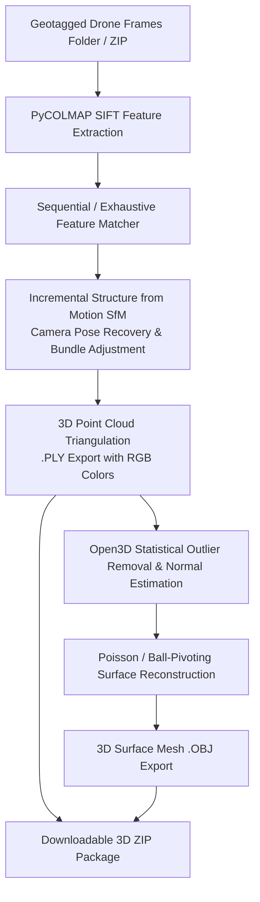

# 🗿 OrthoGenerator: 3D Point Cloud & Mesh Reconstruction Microservice

[](https://fastapi.tiangolo.com)
[](https://github.com/colmap/pycolmap)
[](http://www.open3d.org)

Dedicated microservice for **3D photogrammetric reconstruction** from aerial drone frames. Recovers 3D camera poses, triangulates 3D point clouds, and generates textured 3D surface meshes ready for **MeshLab, CloudCompare, Blender, Unreal Engine, and CAD/GIS 3D viewers**.

---

## 🏗️ Pipeline & Architecture



---

## ✨ Key Features

- **PyCOLMAP SfM Engine**: SIFT feature detection, sequential stereo matching, and bundle adjustment.
- **3D Point Cloud Generation (`.ply`)**: Colorized sparse 3D point cloud with recovered camera stations.
- **3D Mesh Generation (`.obj`)**: High-detail Poisson surface reconstruction and mesh cleanup.
- **Microservice API Architecture**: Asynchronous background workers, live progress polling, zero-copy local path execution, and ZIP downloads.

---

## 📂 Project Structure

```
api_3d_generator/
├── app/
│   ├── main.py                  # FastAPI server (Port 8002)
│   ├── config.py                # Configuration & workers
│   ├── models/schemas.py        # Pydantic request/response schemas
│   ├── services/
│   │   ├── sfm_engine.py        # PyCOLMAP SfM reconstruction engine
│   │   ├── mesh_engine.py       # Open3D Poisson surface meshing engine
│   │   ├── job_manager.py       # Async job queue
│   │   └── pipeline.py          # Unified coordinator
│   └── routers/
│       ├── health.py            # /health check & CUDA status
│       └── reconstruction.py    # /reconstruct-from-path, /jobs endpoints
├── outputs/                     # Storage for 3D outputs
├── tests/
│   └── test_3d.py               # Unit & integration tests
├── client_demo.py               # CLI and API demo client
├── run_server.py                # Server launcher (Port 8002)
├── requirements.txt             # Dependencies
├── Dockerfile                   # Dockerfile
├── docker-compose.yml           # Docker compose file
└── README.md                    # Documentation
```

---

## 🚀 Quickstart Guide

### Option 1: Run with Docker Compose

```bash
cd api_3d_generator
docker-compose up --build -d
```

### Option 2: Run with Python Locally

```bash
cd api_3d_generator
pip install -r requirements.txt
python run_server.py
```
- **Interactive Swagger Documentation**: `http://localhost:8002/docs`
- **Health Check**: `http://localhost:8002/api/v1/health`

---

## 🔌 API Endpoints Reference

| Method | Endpoint | Description |
|---|---|---|
| `GET` | `/api/v1/health` | Health status, PyCOLMAP/Open3D versions, CUDA availability |
| `POST` | `/api/v1/3d/reconstruct-from-path` | Trigger 3D reconstruction from server frames folder |
| `POST` | `/api/v1/3d/reconstruct-from-upload` | Upload ZIP of frames for 3D reconstruction |
| `GET` | `/api/v1/3d/jobs` | List recent 3D jobs |
| `GET` | `/api/v1/3d/jobs/{job_id}` | Check job progress, points count, and download links |
| `GET` | `/api/v1/3d/jobs/{job_id}/pointcloud` | Download 3D Point Cloud (`.ply`) |
| `GET` | `/api/v1/3d/jobs/{job_id}/mesh` | Download 3D Surface Mesh (`.obj`) |
| `GET` | `/api/v1/3d/jobs/{job_id}/download` | Download full 3D ZIP package |

---

## 💻 API Usage Examples

```bash
curl -X POST "http://localhost:8002/api/v1/3d/reconstruct-from-path?async_mode=true" \
  -H "Content-Type: application/json" \
  -d '{
    "frames_dir": "D:/ortho_generator/api_video_ortho/outputs/sample_run/frames",
    "matching_method": "sequential",
    "generate_mesh": true,
    "mesh_method": "poisson",
    "poisson_depth": 8,
    "job_name": "survey_3d_model"
  }'
```
