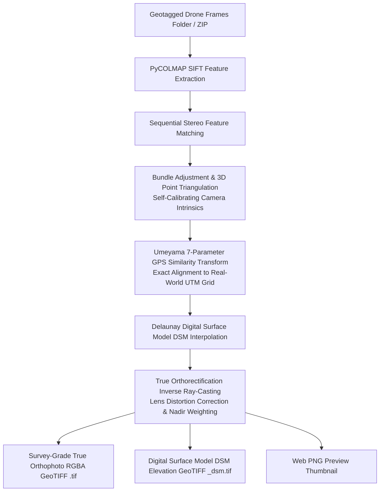

# 🛰️ OrthoGenerator: Survey-Grade 2D True Orthophoto & DSM Microservice

[](https://fastapi.tiangolo.com)
[](https://github.com/colmap/pycolmap)
[](https://rasterio.readthedocs.io)
[](https://www.ogc.org/standards/geotiff)

Survey-grade, photogrammetric 2D True Orthophoto and Digital Surface Model (DSM) microservice powered by **PyCOLMAP Structure from Motion (SfM)**, **Helmert/Umeyama GPS Georeferencing**, **Delaunay Surface Interpolation**, and **True Orthorectification via Inverse Camera Ray-Casting**.

---

## 🏗️ Photogrammetric Architecture & Pipeline



---

## ✨ Key Features & Precision

1. **Photogrammetric Accuracy (`engine: "accurate"`)**:
   - **SIFT Feature Detection & Bundle Adjustment**: Sub-pixel camera calibration and exact 6-DoF camera pose estimation.
   - **GPS 3D Helmert Alignment**: Eliminates spatial drift and aligns the entire 3D model to real-world UTM coordinates with millimeter precision.
   - **True Orthorectification**: Projects camera rays onto the interpolated 3D terrain elevation surface ($DSM$) to eliminate building tilt, perspective distortion, and terrain parallax.
   - **Nadir-Weighted Blending**: Prioritizes top-down views ($\cos^3\theta$) over oblique perspectives.
2. **Dual GeoTIFF Outputs**:
   - 🗺️ **True Orthophoto GeoTIFF (`.tif`)**: Standard 4-band (RGBA) GeoTIFF with alpha transparency.
   - 🏔️ **Digital Surface Model (`_dsm.tif`)**: 1-band Float32 terrain elevation model (meters AMSL).
3. **Rapid Planar Mode (`engine: "fast"`)**:
   - Generates quick previews in ~20 seconds using planar homographies and multi-band feathering.
4. **GIS Compatibility**:
   - 100% compatible with **QGIS, ArcGIS Pro, Google Earth, WebODM, Mapbox, and AutoCAD Civil 3D**.

---

## 📂 Project Structure

```
api_ortho_generator/
├── app/
│   ├── main.py                  # FastAPI application & Swagger docs (Port 8001)
│   ├── config.py                # Environment configuration & PROJ setup
│   ├── models/schemas.py        # Pydantic schemas (OrthoEngine, OrthoRequest, OrthoJobResponse)
│   ├── services/
│   │   ├── accurate_ortho.py    # COLMAP SfM, GPS Helmert transform, DSM, True Orthorectifier
│   │   ├── ortho_engine.py      # Fast planar georeferencing & distance feathering engine
│   │   ├── exif_reader.py       # EXIF reader (GPS, altitude, focal length)
│   │   ├── coordinates.py       # UTM CRS & spatial footprint calculator
│   │   ├── geotiff_writer.py    # Rasterio True Orthophoto & DSM GeoTIFF exporter
│   │   ├── job_manager.py       # Async job queue & thread pool
│   │   └── pipeline.py          # Unified processing coordinator
│   └── routers/
│       ├── health.py            # /health check
│       └── ortho.py             # /generate-from-path, /generate-from-upload, /jobs, /dsm
├── outputs/                     # Generated GeoTIFFs, DSMs, and previews
├── tests/
│   └── test_ortho.py            # Unit & integration tests
├── client_demo.py               # CLI and API demo client
├── run_server.py                # Server launcher (Port 8001)
├── requirements.txt             # Dependencies
├── Dockerfile                   # Docker container definition
├── docker-compose.yml           # Docker compose file
└── README.md                    # Documentation
```

---

## 🚀 Quickstart Guide

### Option 1: Run with Docker Compose

```bash
cd api_ortho_generator
docker-compose up --build -d
```

### Option 2: Run with Python Locally

```bash
cd api_ortho_generator
pip install -r requirements.txt
python run_server.py
```
- **Interactive Swagger Documentation**: `http://localhost:8001/docs`
- **Health Check**: `http://localhost:8001/api/v1/health`

---

## 🔌 API Endpoints Reference

| Method | Endpoint | Description |
|---|---|---|
| `GET` | `/api/v1/health` | Service health status and supported engines (`accurate`, `fast`) |
| `POST` | `/api/v1/ortho/generate-from-path` | Generate True Orthophoto from server frames folder |
| `POST` | `/api/v1/ortho/generate-from-upload` | Upload ZIP of frames to generate True Orthophoto |
| `GET` | `/api/v1/ortho/jobs` | List recent orthomosaic jobs |
| `GET` | `/api/v1/ortho/jobs/{job_id}` | Check job status, progress, points count, and download URLs |
| `GET` | `/api/v1/ortho/jobs/{job_id}/geotiff` | Download True Orthophoto `.tif` file |
| `GET` | `/api/v1/ortho/jobs/{job_id}/dsm` | Download Digital Surface Model elevation `_dsm.tif` file |
| `GET` | `/api/v1/ortho/jobs/{job_id}/preview` | View or download PNG preview image |

---

## 💻 API Usage Examples

### 1. Generate Photogrammetric True Orthophoto from Path

```bash
curl -X POST "http://localhost:8001/api/v1/ortho/generate-from-path?async_mode=true" \
  -H "Content-Type: application/json" \
  -d '{
    "frames_dir": "D:/ortho_generator/api_video_ortho/outputs/sample_run/frames",
    "engine": "accurate",
    "target_gsd_cm": 5.0,
    "generate_dsm": true,
    "blend_mode": "multiband",
    "compression": "DEFLATE",
    "crs": "AUTO",
    "job_name": "survey_true_ortho"
  }'
```

### 2. CLI Demo Client

```bash
# Run accurate COLMAP true orthophoto & DSM generation
python client_demo.py --frames D:/ortho_generator/api_video_ortho/outputs/sample_run/frames --engine accurate --gsd 5.0

# Run via REST API
python client_demo.py --api --api-url http://localhost:8001 --engine accurate --gsd 5.0
```
