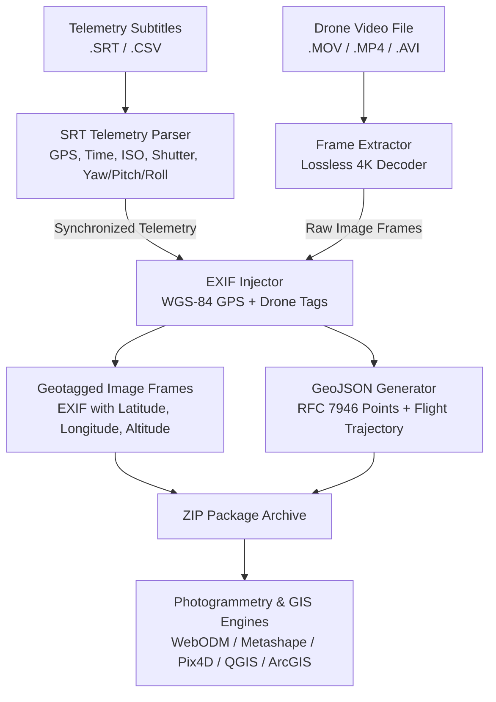

# 🛰️ OrthoGenerator: Drone Video-to-Frame Geotagging & Telemetry Microservice

[](https://fastapi.tiangolo.com)
[](https://www.python.org)
[](https://www.docker.com)
[](https://en.wikipedia.org/wiki/Exif)
[](https://geojson.org)

High-performance, containerized microservice API designed to extract high-fidelity video frames from drone video files (`.MOV`, `.MP4`, `.AVI`, `.MKV`), parse synchronized telemetry from `.SRT` / `.CSV` subtitle tracks, embed WGS-84 GPS coordinates and camera orientation parameters into image EXIF metadata, and generate RFC 7946 GeoJSON flight trajectory datasets ready for photogrammetry and GIS.

---

## 📑 Architecture Overview



---

## ✨ Key Features

- **Lossless / Maximum Quality Frame Extraction**: Extracts uncompressed RGB frames preserving full native resolution (e.g. 4K UHD $3840 \times 2160$ or 8K) and saves using maximum quality JPEG (`quality=100`, 4:4:4 chroma subsampling) or PNG.
- **Robust Multi-Vendor SRT Parser**: Handles DJI drone telemetry subtitles (including standard format, bracketed tags `[latitude : 13.398...]`, ISO, shutter speeds `1/640.0`, focal length, aperture f-number, EV, color temperature, and gimbal orientation `yaw`, `pitch`, `roll`).
- **Standard EXIF & GPS Metadata Injection**: Embeds standard rational DMS coordinates (`GPSLatitude`, `GPSLongitude`, `GPSAltitude`, `GPSTimeStamp`, `GPSDateStamp`), camera parameters (`ISOSpeedRatings`, `FNumber`, `ExposureTime`, `FocalLength`, `DateTimeOriginal`), and full telemetry JSON payload into `UserComment`.
- **RFC 7946 GeoJSON Generation**: Automatically produces a standard GeoJSON `FeatureCollection` with:
  - 📍 `Point` features for every extracted frame (with full properties: coordinates, timestamp, camera settings, image filename).
  - ✈️ `LineString` feature tracing the complete sequential flight trajectory with distance calculation in meters.
  - 📦 Bounding box (`bbox`) and summary metadata.
- **Photogrammetry Ready**: Generated images are immediately compatible with **WebODM**, **Agisoft Metashape**, **Pix4D**, **RealityCapture**, and GIS tools like **QGIS** and **ArcGIS Pro**.
- **Microservice API Architecture**: REST API with asynchronous background jobs, live progress tracking, zero-copy local path execution, direct GeoJSON downloads, and ZIP archiving.

---

## 📂 Project Structure

```
api_video_ortho/
├── app/
│   ├── __init__.py
│   ├── main.py                  # FastAPI application entrypoint & docs
│   ├── config.py                # Environment configuration & directories
│   ├── models/
│   │   ├── __init__.py
│   │   └── schemas.py           # Pydantic schemas for requests, jobs, GeoJSON
│   ├── services/
│   │   ├── __init__.py
│   │   ├── srt_parser.py        # Robust SRT / CSV telemetry parsing & indexer
│   │   ├── exif_writer.py       # EXIF / GPS DMS rational encoder & writer
│   │   ├── frame_extractor.py   # OpenCV lossless frame extractor
│   │   ├── geojson_builder.py   # RFC 7946 GeoJSON FeatureCollection builder
│   │   ├── job_manager.py       # Async job queue & thread pool executor
│   │   └── pipeline.py          # Unified end-to-end pipeline coordinator
│   └── routers/
│       ├── __init__.py
│       ├── health.py            # Health check & system metrics
│       └── extraction.py        # API endpoints (/extract-upload, /extract-from-path, /jobs)
├── outputs/                     # Processed jobs, frames, and GeoJSON files
├── tests/                       # Unit & integration test suite
│   ├── test_srt_parser.py
│   ├── test_exif_writer.py
│   ├── test_geojson.py
│   └── test_api.py
├── client_demo.py               # Standalone CLI and API client demo
├── run_server.py                # Fast server launcher
├── requirements.txt             # Python dependencies
├── Dockerfile                   # Production Docker image definition
├── docker-compose.yml           # Docker Compose orchestration
└── README.md                    # Documentation
```

---

## 🚀 Quickstart Guide

### Option 1: Run with Docker Compose (Recommended)

```bash
# Clone or navigate to the directory
cd api_video_ortho

# Build and start container
docker-compose up --build -d

# Check health
curl http://localhost:8000/api/v1/health
```

The interactive Swagger documentation will be available at `http://localhost:8000/docs`.

### Option 2: Run Directly with Python

```bash
# 1. Navigate to directory
cd api_video_ortho
python -m venv .venv# Create venv if required

# 2. Install requirements
pip install -r requirements.txt

# 3. Start the microservice
python run_server.py
```

---

## 🔌 API Endpoints Reference

| Method | Endpoint | Description |
|---|---|---|
| `GET` | `/api/v1/health` | Service health status, system info, and supported formats |
| `POST` | `/api/v1/jobs/extract-upload` | Multipart upload of video + SRT files with extraction parameters |
| `POST` | `/api/v1/jobs/extract-from-path` | Extract from existing video & SRT file paths on server (zero-copy) |
| `GET` | `/api/v1/jobs` | List recent processing jobs |
| `GET` | `/api/v1/jobs/{job_id}` | Check job progress, status, and download links |
| `GET` | `/api/v1/jobs/{job_id}/geojson` | Download or view the generated RFC 7946 GeoJSON |
| `GET` | `/api/v1/jobs/{job_id}/download` | Download full ZIP archive of geotagged frames + GeoJSON |
| `GET` | `/api/v1/jobs/{job_id}/frames/{filename}` | Preview or download an individual geotagged image frame |

---

## 💻 API Usage Examples

### 1. Extract from Local Path (Fastest / Zero-Copy)

```bash
curl -X POST "http://localhost:8000/api/v1/jobs/extract-from-path?async_mode=false" \
  -H "Content-Type: application/json" \
  -d '{
    "video_path": "D:/ortho_generator/F7/DJI_0527.MOV",
    "srt_path": "D:/ortho_generator/F7/DJI_0527.SRT",
    "frame_interval_sec": 1.0,
    "output_format": "jpg",
    "jpeg_quality": 100,
    "include_line_string": true,
    "export_zip": true,
    "export_geojson": true
  }'
```

**Response:**
```json
{
  "job_id": "d61711c1",
  "job_name": "job_d61711c1",
  "status": "COMPLETED",
  "created_at": "2026-08-22T15:43:03.320491",
  "completed_at": "2026-08-22T15:43:08.975123",
  "progress_percent": 100.0,
  "message": "Successfully extracted and geotagged 28 frames in 5.65s",
  "total_video_frames": 662,
  "extracted_frames": 28,
  "video_duration_sec": 27.61,
  "video_fps": 23.98,
  "video_resolution": "3840x2160",
  "geojson_url": "/api/v1/jobs/d61711c1/geojson",
  "download_zip_url": "/api/v1/jobs/d61711c1/download",
  "output_dir": "D:\\ortho_generator\\api_video_ortho\\outputs\\jobs\\d61711c1"
}
```

### 2. Extract from File Upload

```bash
curl -X POST "http://localhost:8000/api/v1/jobs/extract-upload" \
  -F "video=@/path/to/DJI_0527.MOV" \
  -F "srt=@/path/to/DJI_0527.SRT" \
  -F "frame_interval_sec=1.0" \
  -F "jpeg_quality=100" \
  -F "async_mode=true"
```

### 3. Check Job Status

```bash
curl -X GET "http://localhost:8000/api/v1/jobs/{job_id}"
```

### 4. Download Generated GeoJSON

```bash
curl -X GET "http://localhost:8000/api/v1/jobs/{job_id}/geojson" -o flight_telemetry.geojson
```

---

## 🗺️ GeoJSON Sample Output

The generated GeoJSON structure conforms to the RFC 7946 standard:

```json
{
  "type": "FeatureCollection",
  "bbox": [79.563553, 13.397268, 212.1, 79.564167, 13.398962, 214.71],
  "properties": {
    "total_frames": 28,
    "total_distance_meters": 200.9,
    "job_info": {
      "video_file": "DJI_0527.MOV",
      "video_resolution": "3840x2160",
      "video_fps": 23.98,
      "total_video_frames": 662,
      "extracted_frames_count": 28
    }
  },
  "features": [
    {
      "type": "Feature",
      "id": 1,
      "geometry": {
        "type": "Point",
        "coordinates": [79.563553, 13.398962, 214.707]
      },
      "properties": {
        "frame_index": 1,
        "frame_id": 1,
        "filename": "frame_000001.jpg",
        "timestamp": "2024-11-03 11:35:42.416",
        "timestamp_sec": 0.0,
        "latitude": 13.398962,
        "longitude": 79.563553,
        "altitude_m": 214.707,
        "iso": 100,
        "shutter": "1/640.0",
        "f_number": 2.8,
        "focal_length_mm": 28.0,
        "ev": 0.7,
        "ct": 5378,
        "color_mode": "default"
      }
    },
    {
      "type": "Feature",
      "id": "flight_trajectory",
      "geometry": {
        "type": "LineString",
        "coordinates": [
          [79.563553, 13.398962, 214.707],
          [79.563556, 13.398952, 214.612],
          [79.564163, 13.397275, 212.095]
        ]
      },
      "properties": {
        "name": "Drone Flight Trajectory",
        "total_points": 28,
        "total_distance_meters": 200.9,
        "start_time": "2024-11-03 11:35:42.416",
        "end_time": "2024-11-03 11:36:09.408"
      }
    }
  ]
}
```

---

## 🛠️ CLI & Python Client Demo

Run extractions directly from terminal using `client_demo.py`:

```bash
# Extract 1 frame per second (with full EXIF and GeoJSON)
python client_demo.py --video D:/ortho_generator/F7/DJI_0527.MOV --srt D:/ortho_generator/F7/DJI_0527.SRT --interval 1.0

# Extract every 5th frame
python client_demo.py --video D:/ortho_generator/F7/DJI_0527.MOV --srt D:/ortho_generator/F7/DJI_0527.SRT --step 5

# Trigger via Microservice API
python client_demo.py --api --api-url http://localhost:8000 --interval 2.0
```

---

## 🧪 Running Automated Tests

Run the test suite to validate SRT parsing, EXIF generation, GeoJSON schemas, and API routes:

```bash
python -m pytest -v
```

```text
tests/test_api.py::test_health_endpoint PASSED
tests/test_api.py::test_root_redirect PASSED
tests/test_api.py::test_list_jobs_empty PASSED
tests/test_exif_writer.py::test_decimal_to_dms_rational PASSED
tests/test_exif_writer.py::test_parse_shutter PASSED
tests/test_exif_writer.py::test_create_and_read_exif PASSED
tests/test_geojson.py::test_geojson_builder PASSED
tests/test_srt_parser.py::test_parse_srt_text PASSED
tests/test_srt_parser.py::test_lookup_by_timestamp_and_frame PASSED

======================== 9 passed in 1.25s ========================
```

---

## 📄 License & Compatibility
- **Compatible with**: WebODM, OpenSfM, Agisoft Metashape, Pix4Dmapper, RealityCapture, QGIS 3.x, ArcGIS Pro.
- **Standards**: WGS-84 Datum (EPSG:4326), RFC 7946 GeoJSON, EXIF 2.31 Standard.
